<style>
.list-group-item.active, .list-group-item.active:focus, .list-group-item.active:hover {
    background-color: #EA5933;
}
</style>

<style>
.nav>li>a {
    position: relative;
    display: block;
    padding: 10px 15px;
    color: #EA5933;
    font-weight: bold;
}
.nav-pills>li.active>a, .nav-pills>li.active>a:hover, .nav-pills>li.active>a:focus {
    color: white;
    background-color: #EA5933;
}
</style>


<script> 
    $(document).ready(function() { 
    $head = $('#header'); 
    $head.prepend('<A href = https://www.cuttingedge-events.com></A>') 
    }); 
</script> 


```{r echo=FALSE, message=FALSE,warning=FALSE}
library(readxl)
library(dplyr)
library(knitr)
```

# OPCIONES DE CATAMARÁN 

## OPCIÓN 1: 2 Catamaranes de 125 personas cada uno

La primera opción que queremos ofrecer son 2 Catamaranes con una capacidad de 125 personas cada uno. Se trata de dos barcos con una eslora de 24,80 metros cada uno y una amplitud de 12,80 metros.

La tripulación de cada barco está compuesta por 3 marineros + 1 camarero de barra, aunque bajo petición se podría aumentar el número de la tripulación. 
Disponibles 2 baños (una para hombres y uno para mujeres), red de proa para estirarse, barbacoa, barra de bar y equipo de música. 

Son barcos de grandes dimensiones, pero por temas de seguridad se tiene que resrtingir la capacidad de la flota hasta 125. 
Los clientes disfrutarán de un agradable paseo a lo largo de la costa de Barcelona, viendo así todo el "skyline" de la ciudad. 

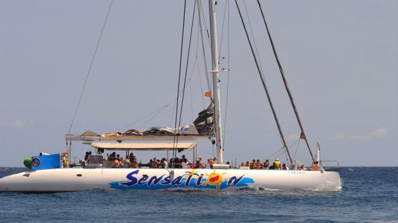

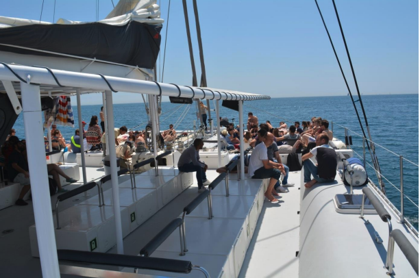

Durante la actividad se pueden añadir servicios de bebidas / comida a bordo: 

* Barbacoa 

* Aperitivos 

* Menús de comida 

* Bebidas (vino, cerveza, sangria, cava). 

Aunque nos gustaría haceros saber un cosa en el caso que los clientes quieran bañarse en el mar: **Las bebidas alcóhlicas no se pueden servir hasta que los clientes hayan terminado el baño**

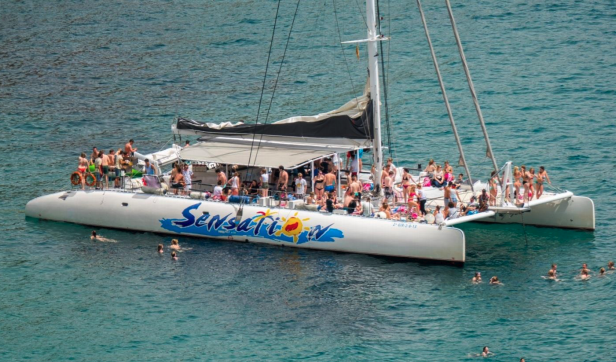

<div class="budget">

<p> Alquiler Catamaranes. 
  <ul>
   
   Precio por 3 horas para las dos embarcaciones (hasta el 31 de Septiembre): **10.075€ IVA incl.**
   
   Precio por 4 horas para las dos embarcaciones (Hasta el 31 de Septiembre): **11.485€ IVA incl.**
   
   Tasa amarre en el puerto: **790€ IVA incl.** 
   
  </ul>
</p>
<p> F&B. 
  <ul>
  
   Aperitivo: 7 platillos diferentes para picar: **Desde 17€ por persona IVA incl.**
   
   Menú Barbacoa --> Entrantes + Barbacoa + Postre: **Desde 48,5€ por persona IVA incl.**
   
   Menú para comida --> Pica Pica: **Desde 35€ por persona IVA incl.**
   
   Pack de bebidas --> Vino, cerveza, sangría y cava: **Desde 19€ por persona IVA incl.**
   
  </ul>
</p>

</div>

<style>

.budget{
background-color: #607D8B;
color: white;
padding: 10px;
border: 1px solid black;
margin-left: 5px;
border-radius: 5px;
font-style: italic;
}
</style>

<br>

## OPCIÓN 2: 1 Catamarán con capacidad para 250 personas.

A diferencia de la primera opción, este es un barco con capacidad para todo el grupo al completo. Se trata del Catamarán a vela más grande de Barcelona, ofreciendo así, dos plantas diferentes para le grupo. 

Este Catamarán se trata de una embarcación ecológicoa (con respeto hacia el mar y el medio ambiente). Es un catamarán de un estilo diferente al primero, meientras que en los dos primeros catamaranes todo el espacio es exterior, este tiene una parte que es cubierta, en el caso que los clientes quisieran estar en interior un rato. 

Este Catamarán ofrece Solárium, visión submarina, 3 redes delanteras con capacidad para 15 personas, 2 WC, equipo de sonido, etc. 

La ruta que ofrecen es muy similar a la Opción 1, “Barcelona desde el Mar”.  Una Barcelona totalmente diferente a la que conocemos a pie. Desde el mar veremos algunos de los edificios más emblemáticos de la ciudad: Sagrada Familia, Torre Agbar, Tibidabo, Forum, Montjuic, Ramblas, etc.  ¡Es realmente impresionante! 

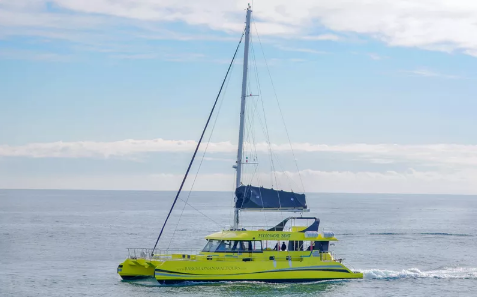


En este catamarán también hay la posibilidad de añadir servicio de comida y bebida a bordo. Los servicios son muy similares a la opción A:

* Aperitivo

* Bebidas

* Menú comida

* Barbacoa

* Menú cocktail

<div class="budget">

<p> Alquiler Catamaranes. 
  <ul>
   
   Precio por 4 horas. 1 embarcación de 250 plazas. (Septiembre): **6.110€ IVA incl.**
   
   Alquiler hora previa para preparación: **770€ IVA incl.**
   
  </ul>
</p>
<p> F&B. 
  <ul>
  
   Barra libre durante 3 horas: **53€ por persona IVA incl.**
   
   Aperitivo --> 4 platillos a compartir: **Desde 9€ por person iva INCL.**
   
   Pica-pica (9 platos para picar): **Desde 22€ por persona IVA incl.**
   
   Menú buffet (12 platos, con bebidas incluidas: vino, cerveza, refresco y agua durante 2 horas): **Des de 50€ por persona IVA incl.**
   
   Menú coctel (8 variedades + postres): **Desde 85€ por persona IVA incl.**
   
   Transporte: **235€ IVA incl.**
   
   Precio por camarero: **155€ IVA incl.**
   
  </ul>
</p>

</div>

<style>

.budget{
background-color: #607D8B;
color: white;
padding: 10px;
border: 1px solid black;
margin-left: 5px;
border-radius: 5px;
font-style: italic;
}
</style>

<br>

## OPCIÓN 3: Regata Team Building

La regata ofrecida es una actividad de Team Building en la que se dividirá el grupo en otros más pequeños de 6-7-8 personas. 
La regata estará formada por unos 30 veleros + 1 barco del comité.

Esta actividad puede adoptar una característica más competitiva o lúdica, dependiendo de las inquietudes del cliente, por lo tanto, el nivel de exigencia y profesionalidad lo decide el cliente. El qeuipo puede tripular el barco bajo la supervisión del capitán o simplemente relajarse y disfrutar de la actividad de Team Building. 

El evento empieza con unos 20-30 minutos de práctica en el mar una vez hayan salido del puerto. Después de la práctica empieza la regata. Dentro de cada embarcación los lcientes encontrarán refrescos y agua para los participantes. 

La duración de la actividad es de unas 4 horas aproximadamente. Des de que suben a las embarcaciones hasta la posterior entrega de premios y ceremonia. 

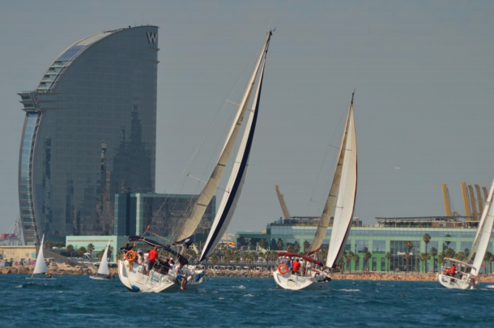

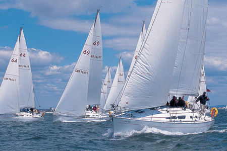

<div class="budget">

<p> Actividad. 
  <ul>
   
   Regata para 240 personas, con unos 30 veleros aproximadamente. Incluye toda la organización del evento (personal, barcos, personal de tierra, montaje de la regata, etc.): **28.400€ IVA incl**
   
  </ul>
</p>
<p> F&B. 
  <ul>
  
   Bebidas no alcohólicas a bordo para los participantes: **8,5€ por persona IVA incl.**
   
  </ul>
</p>

</div>

<style>

.budget{
background-color: #607D8B;
color: white;
padding: 10px;
border: 1px solid black;
margin-left: 5px;
border-radius: 5px;
font-style: italic;
}
</style>

<br>

# ACTIVIDADES EN LA PLAYA

## PLAYA SAN SEBASTIÁN

*Disponibles los días: 4,5, 12, 18 y 19 de Septiembre.*

Delante de la Playa San Sebastián se encuentran unas fantasticas instalaciones deportivas capacitadas para organizar actividades deportivas y recreativas para empresas.  Club Natació Barcelona.

Las pistas de futbol y voley se encontraran a escasos metros del agua del mar, por lo que los clientes podrán combinar el deporte con relajación en las sillas o las hamacas, y con unbaño refrescante en el Mar Mediterraneo. 

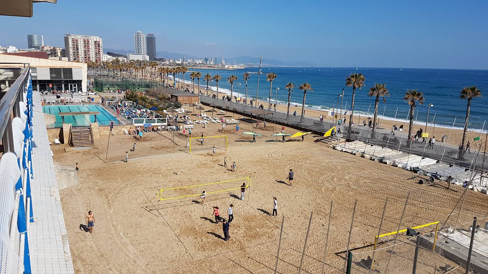

La Playa de San Sebastián ofrece unas magníficas vistas sobre uno de los hoteles más emblemáticos de Barcelona, el hotel W. 

*Recalcar que durante un evento deportivo en Barcelona no se puede beber bebidas alcohólicas en zonas públicas, es por esto que durante el evento el grupo no podrá beber cerveza. No obstante, ofrecemos la posibilidad de tener 400 botellines de agua y 200 refrescos (aquarius, cola, etc.)*

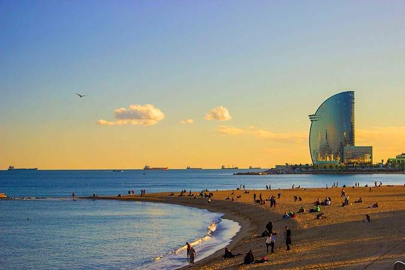

<br>

<div class="budget">

<p> Actividades. 
  <ul>
   
   Cancha de Voley playa. Precio por cada hora: **115€ IVA incl**
   
   Cancha de futbol en la playa. Precio por cada hora: **180€ IVA incl.**
   
   Sombrillas. Precio por cada sombrilla: **9€ IVA incl.**
   
   Hamacas. Precio por cada hamaca: **5€ IVA incl**
   
  </ul>
</p>
<p> F&B. 
  <ul>
  
   Paquete de bebidas: 400 botellines de agua y 200 refrescos: Por confirmar
   
  </ul>
</p>

</div>

<style>

.budget{
background-color: #607D8B;
color: white;
padding: 10px;
border: 1px solid black;
margin-left: 5px;
border-radius: 5px;
font-style: italic;
}
</style>

<br>

## PLAYA LA MAR BELLA

Delante de la Playa de la Mar bella se encuentra la Base Náutica Municipal de Barcelona. Al tratarse de un espacio público y de un grupo tan grande es posible que se tengan que pedir premisos al ayuntamiento si se quiere señalizar la zona, en este caso, pues, no sería posible establecer ni hamacas ni sombrillas en la playa. 

No obstante, la Base Náutica dispone de un espacio prolongado en la playa para la entreada al agua y donde se pueden instalar varios campos de vollei o futvollei.

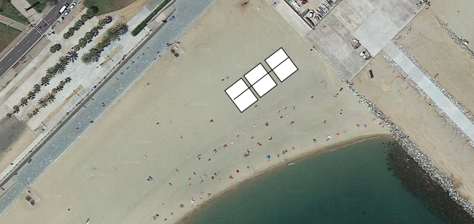

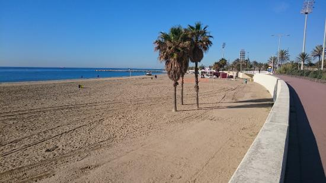

Como os hemos comentado anteriormente, el uso de las bebidas alcoholicas durante eventos deportivos están prohibidas. No obstante, los clientes pueden tener botellines de agua durante el juego y servir cervezas en las instalaciones de la Base Náutica, pues dispone de un bar en su interior.

Los clientes también pueden usar las instalaciones de la Base Náutica para relajarse (sillas, bar, vestuarios, duchas, etc.) durante el tiempo que esten allí. 

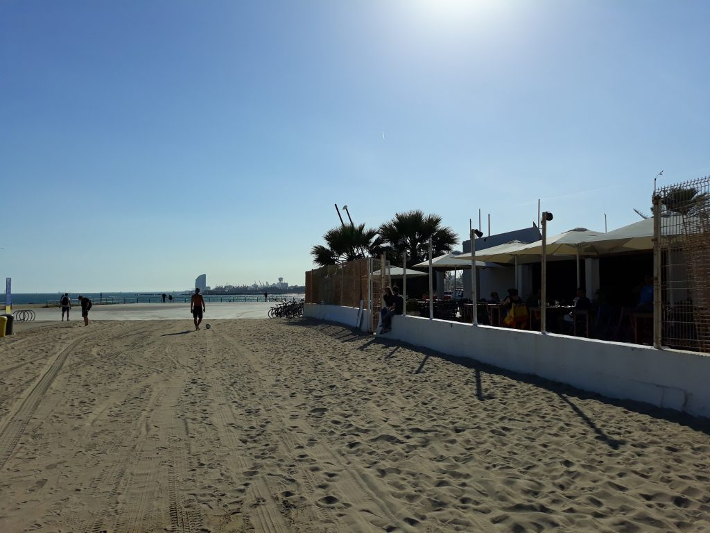

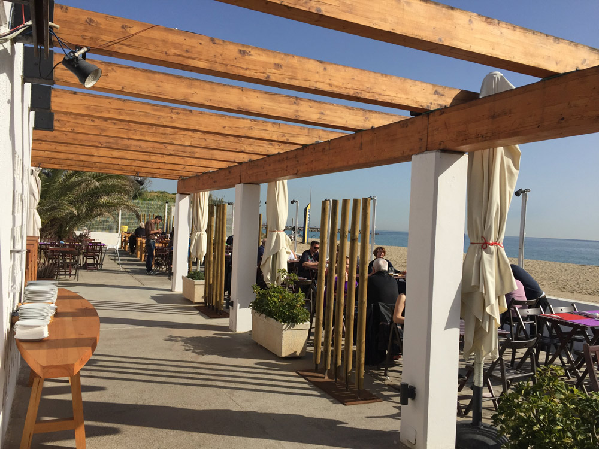

<div class="budget">

<p> Actividades. 
  <ul>
   
   Alquiler cancha de Vollei. Precio único para todas las horas: **150€ IVA incl.**
   
   Alquiler cancha FutVollei. Precio único por todas las horas: **150€ IVA incl.**
   
   Alquiler uso instalaciones Base Náutica: **12,5€ por persona**
   
  </ul>
</p>
<p> F&B. 
  <ul>
  
   Barril para 200 cervezas: **650€ IVA incl**
   
   400 botellas de agua durante evento: **1450€ IVA incl.**
   
  </ul>
</p>

</div>

<style>

.budget{
background-color: #607D8B;
color: white;
padding: 10px;
border: 1px solid black;
margin-left: 5px;
border-radius: 5px;
font-style: italic;
}
</style>

<br>

# TÉRMINOS Y CONDICIONES

  * Tarifas válidas para Septiembre de 2020
  
  * Precios netos Integra Convenciones.
  
  * Por un grupo mínimo de 240 personas.
  
  * Cutting Edge Events management fee incluido en los precios.
  
  * IVA incluido. 
  
  * No se ha reservado ningún servicio. Disponibilidad bajo petición.
  
*****


